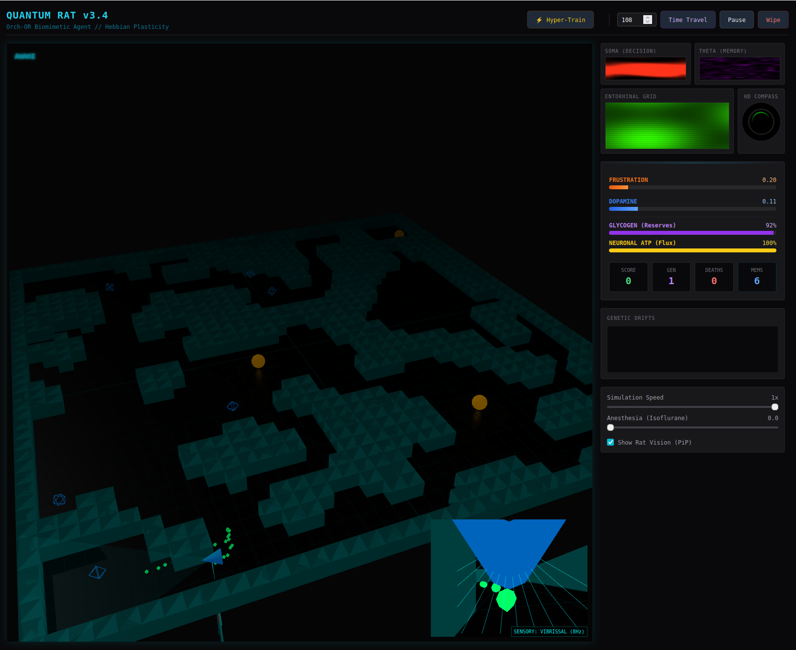

# The Quantum Rat v2.0: A Biophysical Brain Emulator

> "What if AI wasn't just math, but biology? What if an agent learned not because of gradient descent, but because it was hungry?"



## Overview

Most modern AI (like Deep Learning) is Connectionist. It assumes infinite energy, perfect timing, and optimizes abstract weights to minimize error via backpropagation.

The Quantum Rat is different. It is a Biophysical Emulator. It simulates the physical constraints that real biological brains face: thermodynamics, energy bottlenecks, quantum coherence thresholds, and molecular decay.

This is an experiment in Biomimetic AI—building intelligence from the bottom up, starting with the microtubule and ending with behavior.

## Why is this interesting?

This simulation creates a "digital organism" that exhibits emergent behaviors we usually only see in real animals, without hard-coding them:

1.  **The Zombie Effect:** You can administer simulated "Anesthesia" (Isoflurane). This dampens the quantum dipole oscillations in the simulated microtubules. The rat keeps moving reflexively (zombie mode) but loses the ability to form complex plans or memories.
2.  **Cognitive Fatigue:** The rat has a metabolic engine. If it sprints or thinks too hard, its transporters (MCTs) physically cannot shuttle fuel fast enough. It will "bonk" and experience decision paralysis, even if it has energy reserves.
3.  **Flashbulb Memories:** Instead of backpropagation, it uses Synaptic Tagging and Capture (STC). A single high-reward event (finding cheese) floods the system with proteins, instantly locking in the memory of the path taken.

## Under the Hood: The Architecture

The simulation runs on a custom Python physics backend (NumPy) with a real-time WebGL frontend (Three.js).

### 1. The Quantum Core (Orch OR)
Instead of standard bits, the decision-making substrate is a cellular automaton running on a cylindrical hexagonal lattice. It mimics the quantum dipole interactions of tubulin proteins inside microtubules.
* **Mechanism:** It evolves via a Schrodinger-like equation. When the system achieves high coherence (Superradiance), it "collapses" to a decision vector.

### 2. The Metabolic Engine (ANLS)
Energy isn't just a number; it's a flow. We simulate the Astrocyte-Neuron Lactate Shuttle.
* **Mechanism:** Calculates ATP production via Michaelis-Menten kinetics. Learning is gated by extracellular lactate levels—a "hungry" brain physically cannot write new memories.

### 3. The Searchlight (TRN)
The Thalamic Reticular Nucleus acts as a hardware-level attention filter.
* **Mechanism:** Uses Lateral Inhibition to focus attention. If "Fear" (Amygdala) is high, it physically inhibits the "Memory" circuits to focus entirely on visual threats.

### 4. Action & Time (PBWM & PVLV)
Combines Reinforcement Learning with working memory gating.
* **Mechanism:** The rat learns to predict rewards before they happen (PVLV) and uses Time Cells to understand temporal sequences, not just spatial ones.

## Quick Start

1.  **Clone the repo**
    ```bash
    git clone [https://github.com/yourusername/quantum-rat.git](https://github.com/yourusername/quantum-rat.git)
    cd quantum-rat
    ```

2.  **Install dependencies**
    ```bash
    pip install flask numpy
    ```

3.  **Run the brain**
    ```bash
    python app.py
    ```

4.  **Open the MRI Scanner**
    Go to `http://localhost:5000` in your browser.

## Experiments to Try

Once the simulation is running, manipulate the biophysics to see how behavior changes:

* **The Anesthesia Test:** Slide "Anesthesia" to 1.0. Watch the Soma heatmap go dark. The rat will stop solving the maze and start wandering aimlessly.
* **Turbo Training:** Click "Hyper-Train". Watch the "Genetic Drifts" graph. You will see sudden spikes where the rat makes a discovery and the STC system locks it in.
* **Starvation:** Let it run in Turbo mode until Glycogen (Purple Bar) drops significantly. Notice how the rat becomes sluggish and stops learning new paths due to the closed metabolic gate.

## Future Roadmap: Robotics

This architecture is lightweight enough to run on edge hardware (Raspberry Pi / Jetson Nano). The next phase is Embodiment: linking the `Glycogen` variable to a physical robot's battery voltage, creating a robot that seeks a charger because it feels "metabolic anxiety."

## Credits

Concept & Engineering by [Your Name].
Based on the theories of Penrose/Hameroff (Orch OR), Magistretti (ANLS), and O'Reilly (PBWM).