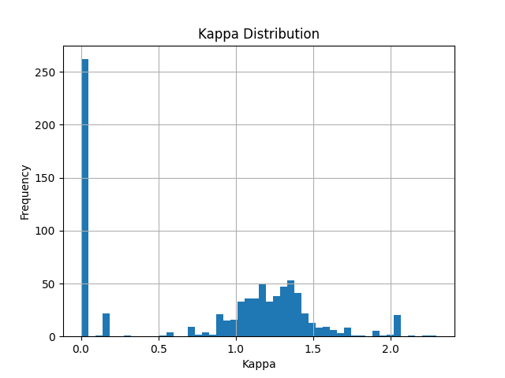
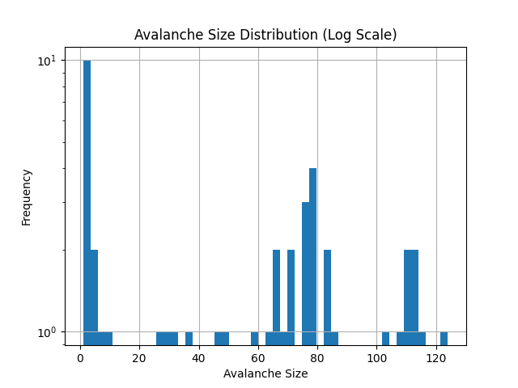
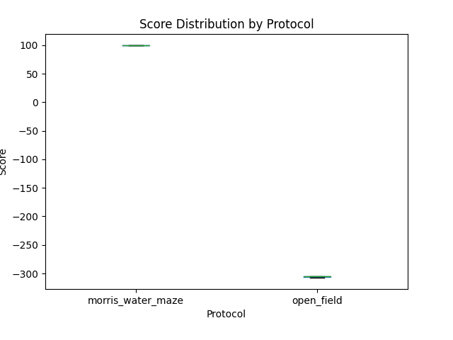

# Analysis Report

## Run Metadata

| Processed Directory   |   Agents |   Protocols |   Episodes |   Ticks |
|:----------------------|---------:|------------:|-----------:|--------:|
| `analysis/processed`  |        4 |           2 |          8 |     828 |

## Kappa Distribution

|     mean |      std |   min |   max |
|---------:|---------:|------:|------:|
| 0.836362 | 0.640579 |     0 |   2.3 |

## Avalanche Size Distribution

|   count |    mean |     std |   min |   max |
|--------:|--------:|--------:|------:|------:|
|      45 | 53.8222 | 40.8786 |     1 |   124 |

## Microsleep and Replay Rates

| protocol          |   microsleep_rate |   replay_rate |
|:------------------|------------------:|--------------:|
| morris_water_maze |             0     |         0     |
| open_field        |             0.625 |         0.625 |

### Gating Sanity Checks

|   % replay_active & ~microsleep_active |   % microsleep_active & ~replay_active |
|---------------------------------------:|---------------------------------------:|
|                                      0 |                                      0 |

## Protocol Score Distributions

| protocol          |   count |     mean |       std |      min |       25% |      50% |       75% |      max |
|:------------------|--------:|---------:|----------:|---------:|----------:|---------:|----------:|---------:|
| morris_water_maze |       4 |   99.289 | 0.0362399 |   99.242 |   99.2765 |   99.292 |   99.3045 |   99.33  |
| open_field        |       4 | -305.555 | 1.21121   | -306.988 | -306.336  | -305.407 | -304.627  | -304.418 |

